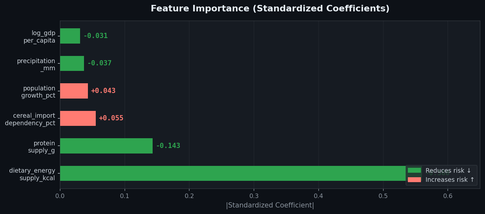
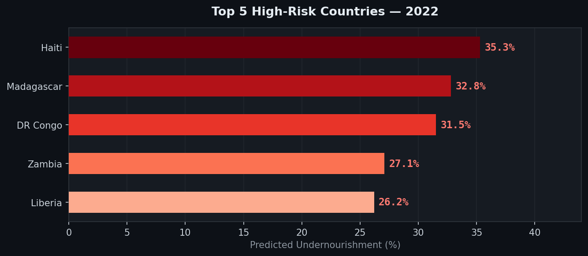
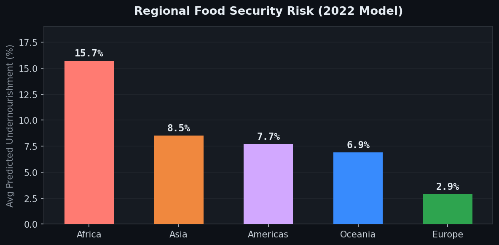

# 🌍 Global Food Security Risk Analysis

> **Identifying countries at highest risk of food insecurity and quantifying the key drivers — economic, agricultural, and climatic — to support policy and strategic decision-making.**


---

## 📋 Overview

| Property | Value |
|----------|-------|
| **Data** | FAOSTAT + World Bank WDI |
| **Coverage** | 200 countries · 2010–2022 |
| **Observations** | 2,599 rows × 18 columns |
| **Model** | Linear Regression (R² = 0.85) |
| **Target variable** | `undernourishment_pct` |

---

## 🔄 Pipeline


| Phase | Notebook | Description |
|-------|----------|-------------|
| **01** | `01_data_loading.ipynb` | Load and inspect FAOSTAT & World Bank datasets |
| **02** | `02_cleaning.ipynb` | Clean, standardize, and merge all sources |
| **03** | `03_eda.ipynb` | Distributions, correlations, clustering, trends |
| **04** | `04_modeling.ipynb` | Linear regression, feature importance, predictions |
| **05** | `docs/` | findings.md · methodology.md · README |

---

## 📊 Key Results

### Model Performance


- **R² = 0.85** — model explains 85% of variance in undernourishment rates
- **Train ≈ Test** — no overfitting
- **148 countries** · 1,313 observations used for modeling

---

### Feature Importance



**Dietary energy supply (kcal/person/day)** is the single most powerful driver — nearly **4× the impact** of the second-ranked feature.

| Rank | Feature | Std. Coefficient | Effect |
|------|---------|-----------------|--------|
| 1 | dietary_energy_supply_kcal | −0.560 | ↓ reduces risk |
| 2 | protein_supply_g | −0.143 | ↓ reduces risk |
| 3 | cereal_import_dependency_pct | +0.055 | ↑ increases risk |
| 4 | population_growth_pct | +0.043 | ↑ increases risk |
| 5 | precipitation_mm | −0.037 | ↓ reduces risk |
| 6 | log_gdp_per_capita | −0.031 | ↓ reduces risk |

> **Note on GDP:** The coefficient appears small due to multicollinearity with `dietary_energy_supply_kcal` (r = 0.80). Both are structurally important — they are two sides of the same development coin.

---

### Highest-Risk Countries (2022)



> Somalia — the highest-risk country in earlier years (52.1%) — is absent from 2022 rankings due to missing data, **not improvement**.

---

### Regional Comparison



- **Africa** is the only region showing **no improvement** over 2010–2022, flat at ~19%
- Africa's risk is **~2× the global average** and **~5× Europe's**
- COVID-19 reversed years of global progress in 2021–2022

---

## 🔑 Key Findings

### 1 — Caloric Supply Dominates
`dietary_energy_supply_kcal` alone accounts for the majority of predictive power. Programs that increase food availability — domestic production, supply chains, waste reduction — will have the greatest measurable impact.

### 2 — Food and Poverty Are Inseparable
GDP per capita and dietary energy supply correlate at **r = 0.80**. Wealthier countries produce and distribute more food. Interventions targeting either in isolation face structural limits — both must be addressed simultaneously.

### 3 — Africa Needs Sustained Commitment
Africa's flat trend over 13 years signals **systemic barriers**, not temporary shocks. Short-term crisis response is insufficient; the region requires sustained long-term investment.

### 4 — COVID Reversed a Decade of Progress
The global undernourishment rate declined from **10.3% (2011) → 9.4% (2020)**, then worsened in 2021–2022. Syria (+10.5 pp) and Kenya (+8.5 pp) saw the steepest reversals. Food systems need resilience, not just response.

### 5 — Political Instability Works Through Economic Channels
`political_stability_index` has a near-zero direct coefficient, but political instability damages food security *indirectly* via GDP destruction and supply chain disruption. Conflict resolution is a food security intervention.

---

## 📁 Repository Structure

```
food-security-risk-analysis/
├── README.md
├── requirements.txt
├── .gitignore
│
├── data/
│   ├── raw/                          ← original FAOSTAT & WDI files
│   └── processed/
│       └── merged_final.csv          ← cleaned, merged dataset (2,599 × 18)
│
├── notebooks/
│   ├── 01_data_loading.ipynb   ✅
│   ├── 02_cleaning.ipynb       ✅
│   ├── 03_eda.ipynb            ✅
│   └── 04_modeling.ipynb       ✅
│
├── src/
│
└── docs/
    ├── findings.md                   ← policy-oriented summary
    ├── methodology.md                ← full technical documentation
    └── figures/                      ← all charts referenced in README
        ├── pipeline.png
        ├── model_metrics.png
        ├── feature_importance.png
        ├── top5_countries.png
        └── regional_risk.png
```

---

## 🚀 Getting Started

### Prerequisites
```bash
pip install -r requirements.txt
```

### Run the Pipeline
```bash
# Execute notebooks in order:
jupyter notebook notebooks/01_data_loading.ipynb
jupyter notebook notebooks/02_cleaning.ipynb
jupyter notebook notebooks/03_eda.ipynb
jupyter notebook notebooks/04_modeling.ipynb
```

### requirements.txt
```
pandas>=2.0
numpy>=1.24
matplotlib>=3.7
seaborn>=0.12
scikit-learn>=1.3
scipy>=1.11
pycountry>=22.3
jupyter>=1.0
```

---

## 📐 Methodology (Summary)

| Step | Description |
|------|-------------|
| **Data Sources** | FAOSTAT Food Security Indicators, Food Balances, Production Indices + World Bank WDI |
| **Cleaning** | BOM removal, `<2.5` recoding, China deduplication, ISO3 manual mapping |
| **Feature Engineering** | `log(gdp_per_capita)`, `log(1 + undernourishment_pct)` as target, multicollinearity removal |
| **Model** | Linear Regression with `StandardScaler` — interpretability prioritized over accuracy |
| **Evaluation** | 80/20 train-test split, R² and RMSE on held-out test set |

Full technical details: [`docs/methodology.md`](docs/methodology.md)
Policy-oriented findings: [`docs/findings.md`](docs/findings.md)

---

## ⚠️ Limitations

| Limitation | Impact |
|------------|--------|
| FAOSTAT 2.5% floor (25% of data) | Artificial lower bound for low-risk countries |
| `poverty_rate` excluded (60.1% missing) | A key driver absent from the model |
| Linear model | May miss non-linear interactions |
| No country fixed effects | Unobserved structural differences uncontrolled |
| Correlation ≠ causation | Coefficients describe association, not causal effect |

---

## 📚 Data Sources

- **FAO** — [FAOSTAT Food Security Indicators](https://www.fao.org/faostat/en/#data/FS)
- **FAO** — [FAOSTAT Food Balances](https://www.fao.org/faostat/en/#data/FBS)
- **FAO** — [FAOSTAT Production Indices](https://www.fao.org/faostat/en/#data/QI)
- **World Bank** — [World Development Indicators](https://databank.worldbank.org/source/world-development-indicators)

---

## 👤 Author

**kota2003**
GitHub: [@kota2003](https://github.com/kota2003)

---

*This project was conducted for analytical and educational purposes. All data is publicly available from the sources listed above.*
